# ⚡ Lightning AI Quick Start - Amharic TTS

This guide helps you quickly set up and run Amharic TTS training in **Lightning AI cloud environment**.

## 🚀 Quick Setup (After Git Pull)

1. **Setup Environment** (Run once after pulling code):
```bash
python lightning_setup.py
```

2. **Launch Training Interface**:
```bash
python gradio_app/full_training_app.py --share
```

## 🔧 Fix: "TTS model not loaded (placeholder mode)"

The warning is **expected behavior** when you first start. Here's what it means and how to fix it:

### Why This Happens:
- ✅ **G2P loaded** - Text processing works
- ✅ **Tokenizer loaded** - If you have a trained tokenizer  
- ⚠️ **TTS model not loaded** - No trained model available yet
- ✅ **SRT Dataset Builder** - Dataset import works

### Solutions (in order of priority):

#### Option 1: Train Your Own Model (Recommended)
1. **Import Dataset**: Use "Dataset Import" tab to upload SRT + audio files
2. **Train Tokenizer**: Go to "Tokenizer Training" tab (if needed)
3. **Setup Model**: Download Chatterbox base model in "Model Setup" tab
4. **Start Training**: Use "Training Pipeline" tab to fine-tune on your data
5. **Model Loads Automatically**: After training starts, checkpoints will be available

#### Option 2: Use Pretrained Model
1. Download a Chatterbox model:
```python
# In the web interface "Model Setup" tab:
# - Choose "Multilingual" model  
# - Click "Download Chatterbox Model"
# - Follow merge and extend steps
```

2. The model will load automatically once available in `models/pretrained/` or `models/checkpoints/`

#### Option 3: Quick Test (Development)
The interface will work in "placeholder mode" for testing text processing, G2P conversion, and tokenization.

## 🎯 Expected Workflow

```mermaid
graph TD
    A[Git Pull Code] --> B[Run lightning_setup.py]
    B --> C[Launch gradio_app/full_training_app.py --share]
    C --> D[⚠️ TTS model not loaded - Expected!]
    D --> E[Import Dataset via Web UI]
    E --> F[Train Tokenizer if needed]
    F --> G[Download & Setup Base Model]
    G --> H[Start Training]
    H --> I[✅ TTS model loaded from checkpoint]
    I --> J[Generate Audio!]
```



## 🔍 Troubleshooting

### "TTS model not loaded" - Still showing after training?

**Check these locations** (model loads automatically from first available):
```bash
# 1. Latest checkpoint (created during training)
models/checkpoints/checkpoint_latest.pt

# 2. Any training checkpoint  
models/checkpoints/checkpoint_epoch*.pt

# 3. Extended pretrained model
models/pretrained/chatterbox_extended.pt

# 4. Any pretrained model
models/pretrained/*.pt
models/pretrained/*.safetensors
```

### Manual Model Loading Test:
```python
# Test in Python console
from src.models.t3_model import SimplifiedT3Model
import torch

# Check if model files exist
from pathlib import Path
print("Checkpoints:", list(Path("models/checkpoints").glob("*.pt")))
print("Pretrained:", list(Path("models/pretrained").glob("*.*")))

# This should work if setup is correct
model = SimplifiedT3Model(vocab_size=3000, n_mels=80)
print("✅ Model creation successful")
```

## 📊 Component Status Meaning

When you see the startup messages:

| Status | Component | Meaning |
|--------|-----------|---------|
| ✅ | G2P loaded | Amharic text → phonemes works |
| ✅ | Tokenizer loaded | Text → tokens works (if available) |
| ⚠️ | TTS model not loaded | **Normal for first run!** |
| ✅ | SRT Dataset Builder | Dataset import ready |

## 🎵 Audio Generation

- **Placeholder mode**: Shows text processing only
- **Model loaded**: Generates actual audio (basic at first)
- **After training**: High-quality Amharic speech

## ⚡ Lightning AI Specific Notes

### GPU Usage:
```python
# Check GPU in the interface or run:
import torch
print(f"CUDA: {torch.cuda.is_available()}")
print(f"GPU: {torch.cuda.get_device_name(0) if torch.cuda.is_available() else 'CPU'}")
```

### Persistent Storage:
- Models and checkpoints persist between sessions
- Upload your data once, train multiple times
- Gradio share links expire but training continues

### Performance:
- Lightning AI GPUs are much faster than local training
- Mixed precision (AMP) enabled by default
- Monitor training via TensorBoard: `tensorboard --logdir logs`

## 🛠️ Development Workflow

**Local (Windows) → Lightning AI:**

1. **Local**: Edit code, commit to GitHub
2. **Lightning**: `git pull origin main`
3. **Lightning**: `python lightning_setup.py` (if needed)  
4. **Lightning**: `python gradio_app/full_training_app.py --share`
5. **Lightning**: Train models using cloud GPU
6. **Local**: Pull trained models if needed

## 🎯 Summary

The **"TTS model not loaded (placeholder mode)"** message is **completely normal** and **expected** when you first start. It simply means:

> *"I'm ready for training, but I don't have a trained model to generate audio yet. Upload data and start training to fix this!"*

The system is working correctly - just needs data and training to unlock audio generation! 🚀